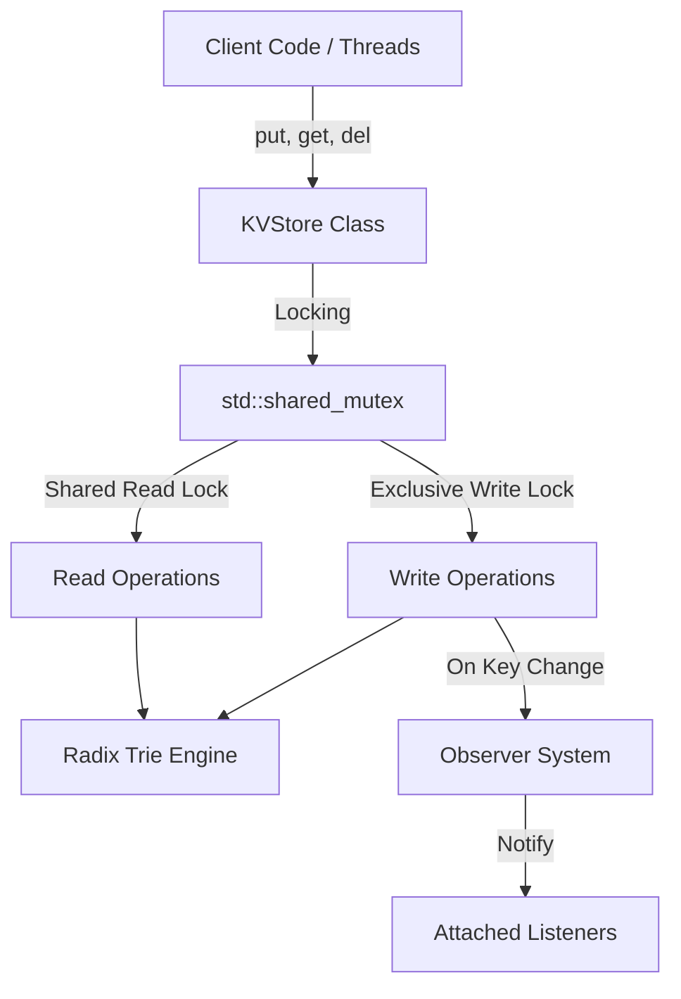

# In-Memory Key-Value Store

> **GitHub Repository Description**: A thread-safe in-memory key-value store built in C++17 using a Radix Trie data structure and shared mutex locks for concurrent reads.

An in-memory key-value store built in C++17. Instead of using a standard hash map, this project uses a Radix Trie as the main data structure. This allows keys to share common prefixes, reducing memory usage for string keys and supporting alphabetical (lexicographical) lookups.

The store is thread-safe and supports concurrent reads, making it suitable for learning core C++ memory management and multithreading concepts.

---

## How It Works

The project separates the data structure logic from thread locking and event notifications.



---

## What It Can Do

- Thread-Safe Operations: Safe to call `put`, `get`, and `del` from multiple threads at the same time.
- Concurrent Reads: Uses `std::shared_mutex` (reader-writer lock) so multiple threads can read data simultaneously without blocking each other. Writes get exclusive access.
- Radix Trie Indexing: Stores string keys efficiently using prefix compression and tree traversal algorithms.
- Ordered Lookups: Supports finding or removing the Nth key in alphabetical order.
- Modern C++ Utilities: Uses `std::string_view` to avoid copying strings in memory, `std::optional` for return values, and smart pointers (`std::unique_ptr`) to prevent memory leaks.
- Event Observers: Uses an Observer pattern (`StoreObserver`) to trigger callbacks whenever keys are added, updated, or deleted.

---

## Project Files

- `kv_store.hpp` / `kv_store.cpp`: Public interface for the key-value store, handling mutex locks and observers.
- `trie.hpp` / `trie.cpp`: Radix Trie data structure implementation and tree navigation logic.
- `store_observer.hpp`: Observer base class for state change notifications.
- `main.cpp`: Multi-threaded demo and testing file.
- `CMakeLists.txt`: CMake build configuration.

---

## How to Build and Run

### Requirements
- C++17 compatible compiler (GCC, Clang, or MSVC)
- CMake (version 3.10 or newer)

### Build Steps

1. Create a build directory:
   ```sh
   mkdir build
   cd build
   ```

2. Generate build files:
   ```sh
   cmake ..
   ```

3. Build the program:
   ```sh
   cmake --build .
   ```

4. Run the executable:
   ```sh
   ./kv_app
   ```

---

## Current Limitations

- In-Memory Only: Data exists only in RAM. If the program closes, all data is lost because there is no file persistence or snapshot feature.
- Simple Locking Strategy: Locks the entire trie during write operations instead of locking individual nodes.
- Local Only: Runs in a single process on one machine (no network or remote API interface).
- No Eviction Policy: Does not automatically remove old keys (like LRU or LFU) when memory fills up.
